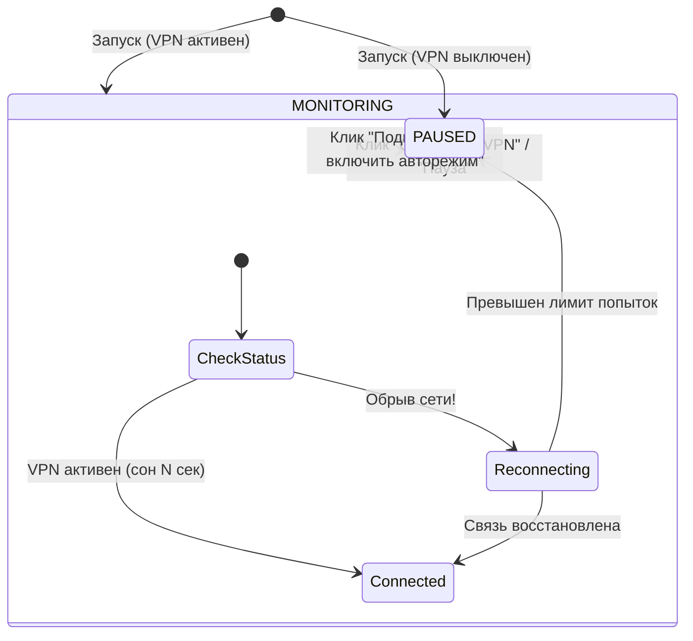

# VPN Guardian 🛡️

[](LICENSE)
[](https://go.dev)
[](https://microsoft.com)
[](#)

> **VPN Guardian** — ультралегковесный сторожевой сервис (Watchdog) для Windows в системном трее, который автоматически восстанавливает разорванные VPN-соединения и **не мешает пользователю, когда он сам решает отключить VPN**.

---

## ⚡ В чем главная проблема существующих решений?

Обычные скрипты автореконнекта страдают критическим недостатком: они **борются с пользователем**. Когда рабочий день закончен или вам нужно выключить VPN, бесконечный цикл пинга видит разрыв и тут же назойливо включает VPN обратно.

**VPN Guardian решает это с помощью четкой машины состояний (State Machine):**
- 🟢 **Автоконтроль:** мониторит туннель каждые N секунд. При сбое сети или обрыве провайдера автоматически запускает серию переподключений с уведомлением в трее.
- ⚪ **Ручной режим (Пауза):** при клике *«⏹ Отключить VPN»* в трее утилита сама разрывает туннель и **замораживает мониторинг**. Она не будет подключать его обратно, пока вы явно не нажмете *«⚡ Подключить»*.
- ⏸ **Временная пауза:** быстрая пауза автореконнекта на 30 минут или 1 час.

---

## 📊 Архитектура и оптимизация



- **Потребление RAM:** всего **8–12 МБ** (в отличие от 100+ МБ у Electron и Python).
- **Потребление CPU:** **0.0%** в режиме ожидания (блокирующий цикл сообщений Win32 API `GetMessageW`).
- **Zero CGO:** собран на чистом Go с прямыми вызовами Win32 Shell API (`Shell_NotifyIconW`), не требует компиляторов C и внешних библиотек.
- **Поддержка перезапуска оболочки:** слушает системное сообщение Windows `TaskbarCreated` и автоматически восстанавливает иконку в трее, если `explorer.exe` упал или перезапустился.

---

## 🔌 Поддерживаемые протоколы и клиенты

| Адаптер | Поддерживаемые протоколы / Клиенты | Метод интеграции |
|---|---|---|
| **Windows Native (`rasdial`)** | SSTP, L2TP/IPSec, IKEv2, PPTP | Нативный Windows RAS API |
| **WireGuard** | Официальный WireGuard Windows Client | `/installtunnelservice`, `/uninstalltunnelservice` |
| **OpenVPN** | OpenVPN GUI | CLI интерфейс (`--connect`, `--command disconnect`) |

---

## 🚀 Быстрый запуск

### Вариант 1: Готовый бинарный файл (Releases)
1. Скачайте свежий `vpn-guardian.exe` со страницы [**Releases**](../../releases).
2. Запустите файл. Иконка появится в области уведомлений Windows (возле часов).
3. Приложение автоматически обнаружит ваши сохраненные подключения Windows и создаст файл конфигурации `%APPDATA%\VPNGuardian\config.json`.

### Вариант 2: Сборка из исходников
```powershell
git clone https://github.com/<your-username>/vpn-guardian.git
cd vpn-guardian
go build -ldflags="-H=windowsgui" -o vpn-guardian.exe
.\vpn-guardian.exe
```

---

## ⚙️ Конфигурация (`config.json`)

Настройки сохраняются в `%APPDATA%\VPNGuardian\config.json` и доступны для редактирования прямо из контекстного меню трея:

```json
{
  "vpn_type": "rasdial",
  "vpn_name": "SG",
  "check_interval_seconds": 5,
  "max_retries": 10,
  "retry_delay_seconds": 4,
  "auto_connect_at_start": false,
  "enable_notifications": true,
  "wireguard_config_path": "",
  "openvpn_profile_name": "",
  "donate_url": "https://boosty.to/your_profile",
  "referral_url": "https://timeweb.cloud/?ref=your_ref_code"
}
```

---

## ⏰ Автозагрузка Windows

Чтобы утилита стартовала вместе с Windows:
```powershell
powershell -ExecutionPolicy Bypass -File .\install-startup.ps1
```
Для удаления из автозагрузки:
```powershell
powershell -ExecutionPolicy Bypass -File .\uninstall-startup.ps1
```

---

## ☕ Поддержка автора и развитие проекта

Если утилита сэкономила вам рабочее время и нервы, вы можете поддержать проект:
- **Boosty / CloudTips:** [boosty.to/your_profile](https://boosty.to)
- **Tinkoff / СБП / Карта:** [Ссылка / номер]
- **USDT (TRC20):** `ВАШ_КОШЕЛЕК`

### 🌐 Надежные VPS для поднятия личного VPN
Для стабильной удаленной работы рекомендуем проверенных провайдеров (быстрый пинг, оплата картами РФ и криптой):
- 👉 [**Timeweb Cloud**](https://timeweb.cloud) — VPS с предустановленным WireGuard/OpenVPN в 1 клик.
- 👉 [**Aeza**](https://aeza.net) — высокоскоростные каналы без лимита трафика.

---

## 📄 Лицензия

Распространяется под лицензией [MIT](LICENSE). Разрешено коммерческое и некоммерческое использование.
