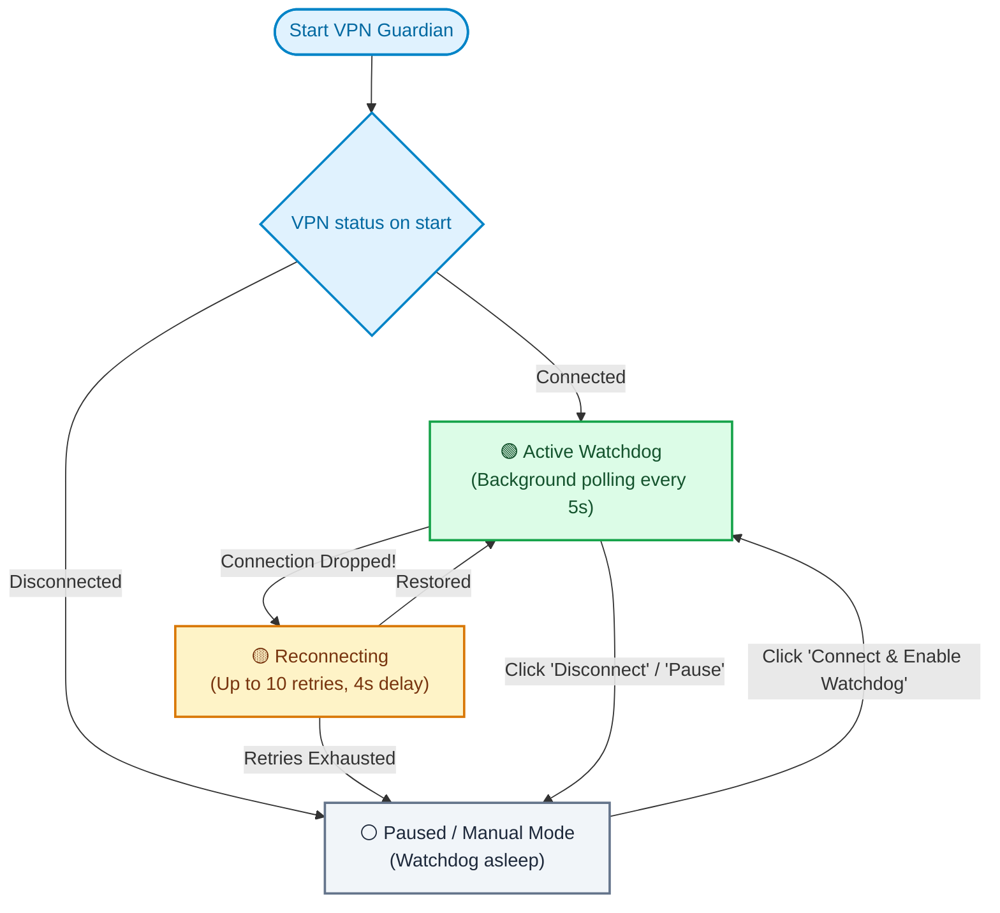

# VPN Guardian 🛡️

[](LICENSE)
[](https://go.dev)
[](https://microsoft.com)
[](#)
[](#)

[🇷🇺 Читать на русском](README.ru.md) | [🇬🇧 English](README.md)

> **VPN Guardian** is an ultra-lightweight Windows system tray watchdog that runs **entirely without administrator privileges**. It automatically detects drops in corporate VPN connections and silently reconnects in the background, keeping your work sessions uninterrupted.

---

## ⚡ The Real Problems It Solves

### 1. Lack of Administrator Rights on Corporate PCs (Primary Problem)
On corporate and enterprise laptops, users almost never have **local administrator privileges (UAC)**.
Standard solutions fail:
- ❌ Cannot install third-party bloated VPN managers or kernel network drivers.
- ❌ Cannot configure elevated background Windows Services.
- ❌ Cannot schedule tasks with elevated privileges in Windows Task Scheduler.

**VPN Guardian runs 100% in User Space:**
- Zero administrator rights required.
- Parses user-level Windows phonebook (`%APPDATA%\...\rasphone.pbk`) in under 0.05 ms.
- Controls connections natively through built-in user-accessible `rasdial`.
- Runs quietly in the user's system notification tray area.

### 2. Silent Disconnections Breaking Flow
Corporate VPN tunnels often drop silently due to Wi-Fi fluctuations, ISP reconnects, or session timeouts:
- Drops SSH sessions, terminates `git push / fetch`, breaks internal databases and web portals.
- Forces you to stop working, open network settings, and manually click "Connect" dozens of times a day.

**VPN Guardian handles reconnection automatically:** instantly detects drops and restores the tunnel in seconds.

### 3. Smart Pause on Deliberate Disconnect
The application distinguishes between an accidental connection drop and your deliberate choice to disconnect:
- 🟢 **Active Watchdog:** Monitors the tunnel and silently reconnects if an unexpected drop occurs.
- ⚪ **Manual Paused Mode:** Clicking *«⏹ Disconnect VPN (Manual Pause)»* in the tray cleanly terminates the tunnel and **suspends the watchdog**. It will never fight you or reconnect until you explicitly click *«⚡ Connect»*.
- ⏸ **Temporary Pause:** Quickly pause auto-reconnect for 30 minutes or 1 hour.

---

## 📊 Architecture & State Workflow



- **RAM Footprint:** Only **8–12 MB** (compared to 100+ MB for Electron/Python apps).
- **CPU Usage:** **0.0%** in idle (blocking Win32 API `GetMessageW` message loop).
- **Zero CGO & Zero Dependencies:** Pure Go standard library + Win32 syscalls (`shell32.dll`, `user32.dll`).
- **Explorer Crash Resilience:** Listens for `TaskbarCreated` system broadcast to restore tray icon if `explorer.exe` restarts.

---

## 🔌 Supported Protocols & Clients

| Adapter | Protocols | Admin Rights Needed? | Integration Method |
|---|---|---|---|
| **Windows Native (`rasdial`)** | SSTP, L2TP/IPSec, IKEv2, PPTP | ❌ **No (User Space)** | Windows RAS API / PBK phonebook |
| **WireGuard** | WireGuard Windows Client | Only when creating service | `/installtunnelservice` |
| **OpenVPN** | OpenVPN GUI | No for normal usage | CLI interface (`openvpn-gui.exe`) |

---

## 🚀 Quick Start

### 1. Prebuilt Binary
Download the latest `vpn-guardian.exe` from [**Releases**](../../releases).
Double-click to launch. It will immediately appear in your taskbar notification area next to the clock and auto-detect your configured Windows VPN connections.

### 2. Build From Source
```powershell
git clone https://github.com/MihailBezukladnikovISiP201/vpn-guardian.git
cd vpn-guardian
go build -ldflags="-H=windowsgui" -o vpn-guardian.exe
.\vpn-guardian.exe
```

---

## ⚙️ Configuration (`config.json`)

Saved automatically in `%APPDATA%\VPNGuardian\config.json` and accessible in 1 click from the tray menu:

```json
{
  "language": "auto",
  "vpn_type": "rasdial",
  "vpn_name": "SG",
  "check_interval_seconds": 5,
  "max_retries": 10,
  "retry_delay_seconds": 4,
  "auto_connect_at_start": false,
  "enable_notifications": true,
  "wireguard_config_path": "",
  "openvpn_profile_name": ""
}
```

*Set `"language": "en"` or `"language": "ru"` to force a specific UI language, or keep `"auto"` to match Windows display language.*

---

## ⏰ Windows Startup (Non-Admin)

To start automatically upon user login:
```powershell
powershell -ExecutionPolicy Bypass -File .\install-startup.ps1
```
To remove from startup:
```powershell
powershell -ExecutionPolicy Bypass -File .\uninstall-startup.ps1
```

---

## 📄 License

Distributed under the [MIT License](LICENSE).
