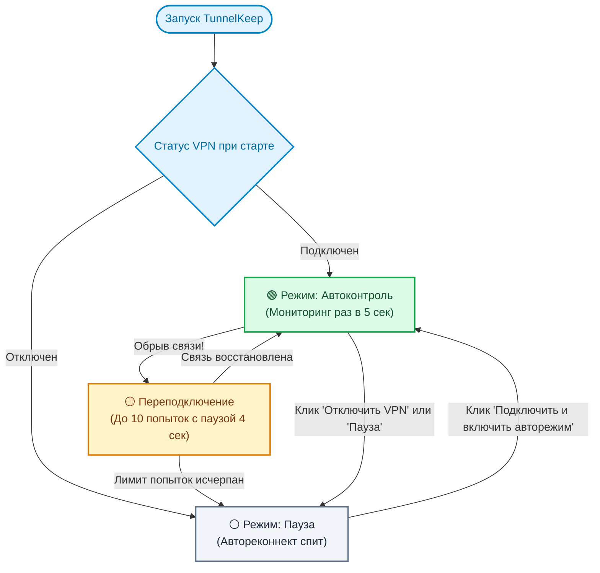

# TunnelKeep 🛡️

[](LICENSE)
[](https://go.dev)
[](https://microsoft.com)
[](#)
[](#)

[🇬🇧 Read in English](README.md) | [🇷🇺 Русский](README.ru.md)

> **TunnelKeep** — ультралегковесный сторожевой сервис (Watchdog) для Windows в системном трее, работающий **полностью без прав администратора**. Автоматически восстанавливает разорванные корпоративные VPN-соединения в фоне, избавляя от рутинных ручных переподключений и потери фокуса.

---

## ⚡ Какую реальную проблему решает проект?

### 1. Отсутствие прав администратора на корпоративных ПК (Главная боль)
На рабочих ноутбуках и офисных машинах у пользователей почти никогда **нет прав локального администратора (UAC)**. 
Из-за этого стандартные решения не работают:
- ❌ Нельзя установить сторонние тяжелые VPN-менеджеры.
- ❌ Нельзя установить системные драйверы, туннельные адаптеры или службы Windows.
- ❌ Нельзя настроить задачи в Планировщике Windows с повышенными привилегиями.

**TunnelKeep работает на 100% в пространстве пользователя (User Space):**
- Не требует прав администратора (UAC).
- Читает профили напрямую из пользовательской телефонной книги Windows (`rasphone.pbk`) за 0.05 мс.
- Управляет туннелем через встроенную штатную утилиту `rasdial`.
- Запускается и работает автономно в трее пользователя.

### 2. Постоянные обрывы и прерывание рабочего процесса
Корпоративные VPN часто тихо разрываются (мигание Wi-Fi, смена IP, таймаут провайдера). В результате:
- Падают SSH-сессии, прерываются `git fetch / git push`, отваливаются внутренние корпоративные порталы и базы данных.
- Приходится постоянно отвлекаться от задач, открывать сетевые настройки и вручную нажимать «Подключить».

**TunnelKeep берет удержание связи на себя:** автоматически фиксирует обрыв и прозрачно для вас поднимает туннель обратно за секунды.

### 3. Умная пауза при осознанном выключении (Встроенная фича)
Приложение отличает аварийный сбой сети от намеренного выключения пользователем:
- 🟢 **Автоконтроль:** следит за туннелем в фоне и спасает при обрывах.
- ⚪ **Ручной режим (Пауза):** при клике *«⏹ Отключить VPN (ручная пауза)»* утилита корректно закрывает туннель и **замораживает мониторинг**, не пытаясь включить его обратно.
- ⏸ **Временная пауза:** быстрая пауза автореконнекта на 30 минут или 1 час.

---

## 📊 Архитектура и переходы состояний



- **Потребление RAM:** **~8–16 МБ** (динамически зависит от количества ядер CPU: ~8 МБ на 4-ядерных ноутбуках и ~15 МБ на 16-ядерных рабочих станциях из-за стеков пула потоков `GOMAXPROCS`; чистая куча самого приложения — всего ~2.5 МБ).
- **Размер бинарника:** **~5.0 МБ** с сохранением стандартной таблицы символов Go для совместимости с корпоративными антивирусами (Kaspersky, Defender), либо ~2.5 МБ при стрипе.
- **Потребление CPU:** **0.0%** в режиме ожидания (блокирующий цикл сообщений Win32 API `GetMessageW`).
- **Zero CGO & Zero Runtime:** собран на чистом Go с прямыми системными вызовами (`shell32.dll`, `user32.dll`), без внешних зависимостей.
- **Устойчивость к сбоям Explorer:** слушает системное событие Windows `TaskbarCreated` и мгновенно пересоздает иконку в трее при перезапуске рабочего стола.

---

## 🔌 Поддерживаемые клиенты и протоколы

| Адаптер | Поддерживаемые протоколы | Права администратора | Метод интеграции |
|---|---|---|---|
| **Windows Native (`rasdial`)** | SSTP, L2TP/IPSec, IKEv2, PPTP | ❌ **Не требуются (User Space)** | Windows RAS API / телефонная книга |
| **WireGuard** | WireGuard Windows Client | Требуются только при установке службы | `/installtunnelservice` |
| **OpenVPN** | OpenVPN GUI | Не требуются для запуска | CLI интерфейс (`openvpn-gui.exe`) |

---

## 🚀 Быстрый запуск

### 1. Скачать готовый бинарник
Скачайте свежий `tunnelkeep.exe` со страницы [**Releases**](https://github.com/MihailBezukladnikovISiP201/tunnelkeep/releases).
Запустите файл двойным кликом — он сразу свернется в трей возле часов и подхватит ваши сохраненные корпоративные подключения.

### 2. Сборка из исходников
```powershell
git clone https://github.com/MihailBezukladnikovISiP201/tunnelkeep.git
cd tunnelkeep
go build -ldflags="-H=windowsgui" -o tunnelkeep.exe
.\tunnelkeep.exe
```

---

## ⚙️ Конфигурация (`config.json`)

Настройки хранятся в `%APPDATA%\TunnelKeep\config.json` и открываются в 1 клик прямо из меню трея:

```json
{
  "language": "auto",
  "vpn_type": "rasdial",
  "vpn_name": "SG",
  "check_interval_seconds": 5,
  "max_retries": 10,
  "retry_delay_seconds": 4,
  "auto_connect_at_start": false,
  "enable_notifications": true,
  "wireguard_config_path": "",
  "openvpn_profile_name": ""
}
```

*Параметр `"language"` можно задать как `"auto"`, `"ru"` или `"en"`.*

---

## ⏰ Автозагрузка Windows (без админских прав)

Чтобы утилита стартовала при входе пользователя в Windows:
```powershell
powershell -ExecutionPolicy Bypass -File .\install-startup.ps1
```
Для удаления из автозагрузки:
```powershell
powershell -ExecutionPolicy Bypass -File .\uninstall-startup.ps1
```

---

## 📄 Лицензия

Распространяется под лицензией [MIT](LICENSE).
